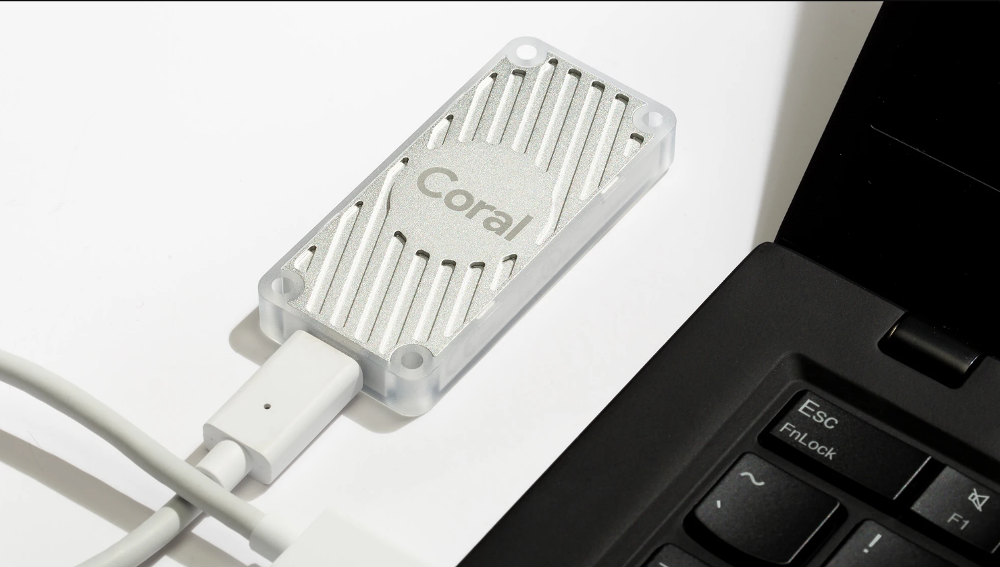
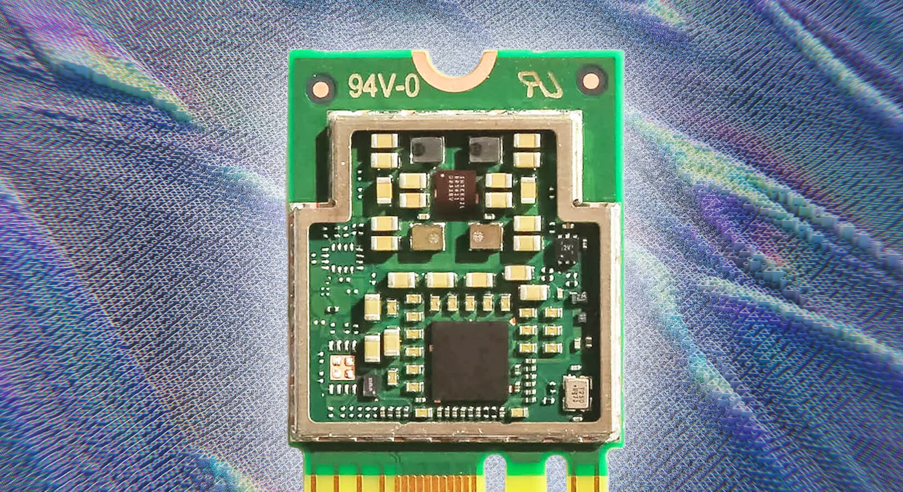
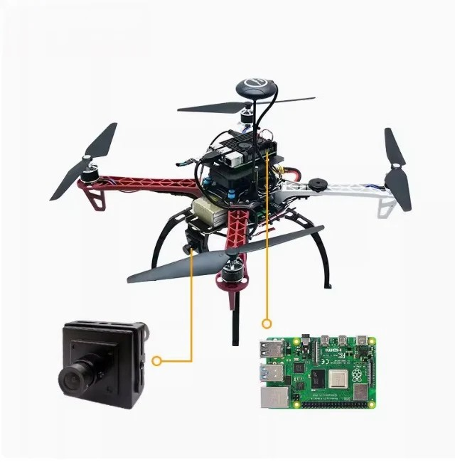
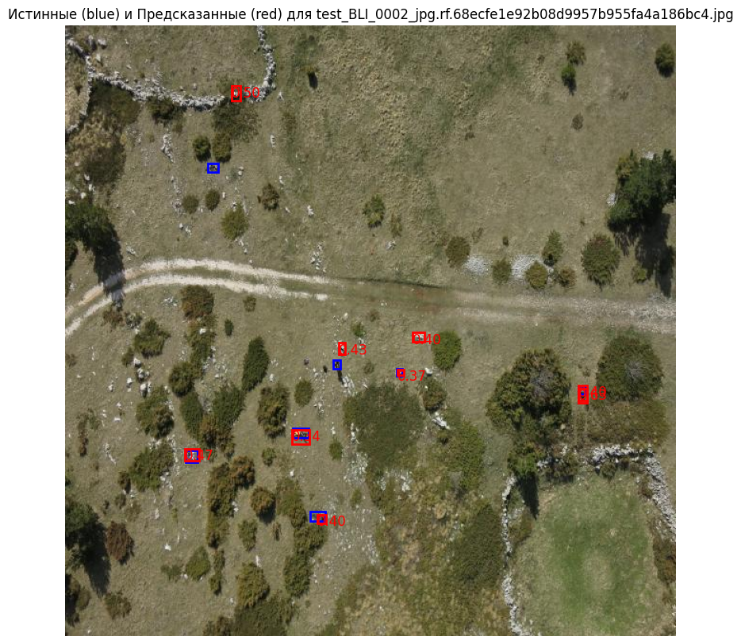
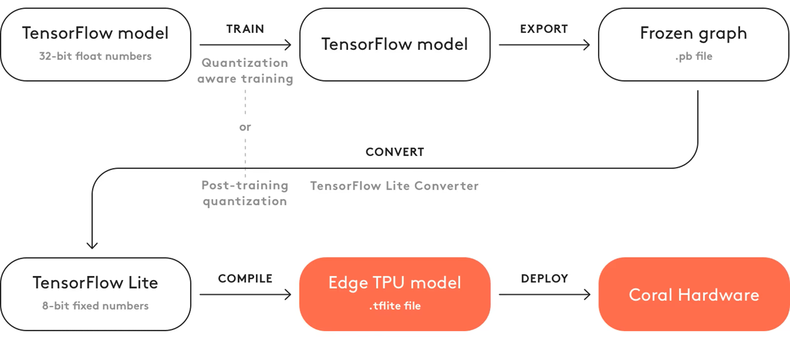

# Использование Coral Edge TPU для задачи детектирования

## Введение

Применение **Coral Edge TPU** открывает новые горизонты в области периферийных вычислений и искусственного интеллекта.
Этот специализированный ускоритель, разработанный Google, предназначен для выполнения задач машинного обучения
непосредственно на устройстве, что значительно снижает задержки и зависимость от облачных сервисов. Основное
преимущество [Coral Edge TPU](https://coral.ai/docs/) заключается в его **высокой энергоэффективности** и компактности,
позволяя интегрировать мощные ИИ-возможности в широкий спектр устройств, от промышленных датчиков до потребительской
электроники.

Эффективность Coral Edge TPU проявляется в способности обрабатывать нейронные сети со скоростью до **4 триллионов
операций в секунду** при минимальном энергопотреблении. Это критически важно для приложений, требующих обработки данных
в реальном времени, таких как распознавание объектов, анализ видеопотока и предиктивная аналитика. Благодаря локальной
обработке данных **повышается конфиденциальность и безопасность**, так как чувствительная информация не покидает
устройство. Кроме того, снижается нагрузка на сетевую инфраструктуру, что особенно актуально в условиях ограниченного
доступа к интернету или при работе с большим объемом данных. Внедрение Coral Edge TPU упрощает развертывание сложных
ИИ-моделей на периферии, делая интеллектуальные системы более **доступными и масштабируемыми**. Это позволяет создавать
инновационные решения, которые ранее были невозможны из-за ресурсных ограничений.

## Барьеры эффективности: Новые подходы к инференсу CV на Edge.

Выполнение вывода (инференса) моделей компьютерного зрения (CV) непосредственно на конечных устройствах, таких как
камеры, датчики или дроны, сопряжено с рядом существенных вопросов. Основная проблематика заключается в ограниченных
вычислительных ресурсах этих устройств: они часто обладают меньшей оперативной памятью, ограниченными возможностями
центрального процессора (CPU) и отсутствием мощных графических процессоров (GPU), характерных для облачных серверов или
рабочих станций. Это приводит к значительному снижению скорости обработки данных, что критически важно для приложений,
требующих реагирования в реальном времени, например, для систем автономного вождения или мониторинга безопасности. Кроме
того, энергопотребление является ключевым фактором для устройств с автономным питанием, где использование сложных
моделей может быстро разрядить батарею. Передача больших объемов видеоданных в облако для обработки также создает
проблемы с задержкой (латентностью), пропускной способностью сети и конфиденциальностью данных. Все эти факторы делают
разработку и развертывание эффективных CV-решений на периферии сложной, но необходимой задачей для многих современных
приложений.

### Применение на автономных компактных устройствах

В частности такие ускорители могут быть установлены на мини компьютерах типа **Raspberry Pi**.
Интеграция Coral Edge TPU с **Raspberry Pi** представляет собой мощную комбинацию для создания недорогих, но
высокопроизводительных AI-систем на периферии. Raspberry Pi, благодаря своей универсальности и доступности, служит
идеальной платформой для развертывания проектов, где требуется локальная обработка данных. Подключение Coral Edge TPU к
Raspberry Pi через USB или PCIe (в зависимости от модели TPU) позволяет значительно увеличить вычислительные возможности
одноплатного компьютера в задачах машинного обучения, не требуя при этом значительных затрат энергии.

Такое сочетание идеально подходит для проектов по **компьютерному зрению**, например, для систем видеонаблюдения с
интеллектуальным анализом, **автономных роботов**, способных распознавать окружение в реальном времени, или **систем "
умного" дома**, реагирующих на голосовые команды или жесты без отправки данных в облако. Возможность локальной обработки
данных повышает конфиденциальность и безопасность, так как чувствительная информация не покидает устройство. Кроме того,
снижается нагрузка на сетевую инфраструктуру, что особенно актуально в условиях ограниченного доступа к интернету или
при работе с большим объемом данных. Внедрение Coral Edge TPU упрощает развертывание сложных ИИ-моделей на периферии,
делая интеллектуальные системы более **доступными и масштабируемыми**. Это позволяет создавать инновационные решения,
которые ранее были невозможны из-за ресурсных ограничений.

Сценарии использования Edge TPU:

* **Системы безопасности и видеонаблюдения:** Edge TPU позволяет локально анализировать видеопотоки для обнаружения
  вторжений, распознавания лиц или аномального поведения без отправки данных в облако.
* **Автономные роботы и дроны:** Интеграция Edge TPU обеспечивает быструю обработку данных с датчиков для навигации,
  избегания препятствий и выполнения задач в реальном времени.
* **"Умный" дом и бытовая техника:** Устройства могут использовать Edge TPU для распознавания жестов, голосовых команд
  или анализа поведения жильцов для персонализированного управления.
* **Промышленный мониторинг и контроль качества:** Edge TPU позволяет инспектировать продукцию на конвейере,
  обнаруживать дефекты или контролировать состояние оборудования в режиме реального времени.
* **Медицинские диагностические устройства:** Портативные приборы могут использовать Edge TPU для ускоренного анализа
  медицинских изображений (например, рентгеновских снимков или УЗИ) непосредственно на месте.
* **Розничная торговля и аналитика покупателей:** Edge TPU помогает отслеживать движение покупателей, анализировать
  поведение в магазинах и оптимизировать выкладку товаров.
* **Сельское хозяйство:** Дроны или роботизированные системы с Edge TPU могут мониторить состояние посевов, обнаруживать
  вредителей или определять потребность в поливе.

### Важность поиска людей на открытой местности с помощью квадрокоптеров и детектирования

Поиск людей на открытой местности, особенно в труднодоступных или обширных районах после стихийных бедствий, является
критически важной задачей, где каждая минута может стоить жизни. Применение **квадрокоптеров** в сочетании с
технологиями **детектирования объектов** становится революционным решением. Традиционные методы поиска часто ограничены
рельефом, видимостью и скоростью охвата территории, тогда как дроны могут быстро обследовать огромные площади, включая
те, которые недоступны для пеших групп или наземной техники. 

Интеграция систем детектирования, работающих на базе
искусственного интеллекта, позволяет автоматически выявлять присутствие людей (или признаков их присутствия, таких как
одежда, следы) на видео- или фотопотоке с дрона, даже в условиях плохой видимости или при малом размере объекта. Это
значительно **сокращает время поиска**, минимизирует человеческий фактор и **повышает эффективность спасательных
операций**, направляя наземные команды непосредственно к месту происшествия.

### Адаптация моделей YOLO для Edge TPU

 

Для того чтобы эффективно использовать мощь Coral Edge TPU для моделей обнаружения объектов, таких как YOLOv5,
необходимо провести процесс **адаптации и конвертации**. YOLOv5, изначально разработанный на фреймворке PyTorch, не
может быть напрямую запущен на Edge TPU. Это требует нескольких этапов преобразования: сначала модель YOLOv5
экспортируется в формат TensorFlow Lite (`.tflite`), который является легковесным форматом, оптимизированным для
периферийных устройств. Ключевым шагом здесь является **квантование модели**, как правило, в 8-битный целочисленный
формат (INT8). Edge TPU разработан для работы именно с квантованными моделями, что позволяет ему достигать высокой
производительности и энергоэффективности, поскольку он оперирует целочисленными вычислениями вместо вычислений с
плавающей запятой. После квантования `.tflite` модель компилируется с помощью **Edge TPU Compiler** в специальный
формат, совместимый с аппаратным ускорителем. Этот процесс гарантирует, что максимальное количество операций модели
будет выполняться непосредственно на TPU, а не на менее производительном центральном процессоре, что критически важно
для обеспечения высокой скорости инференса в реальном времени, необходимой для таких задач, как поиск людей с
квадрокоптера.

## Цель проекта

Целью проекта является - **построение среды конвертации моделей YOLO и анализ эффективности выполнения на TPU**.
Для достижения этой цели необходимо выполнить следующие задачи:

1. Установка и настройка Coral Edge TPU на компьютер под управлением Windows [init.ipynb](init.ipynb)
2. Настройка конвертации стандартных обученных моделей YOLO и выполнение на TPU [yolo_export.ipynb](yolo_export.ipynb)
3. Конвертация модели обученной на датасете детектирования людей на открытой
   местности [yolo_export.ipynb](yolo_export.ipynb)
4. Анализ эффективности выполнение вывода модели на TPU [validate_yolov5.ipynb](validate_yolov5.ipynb)

